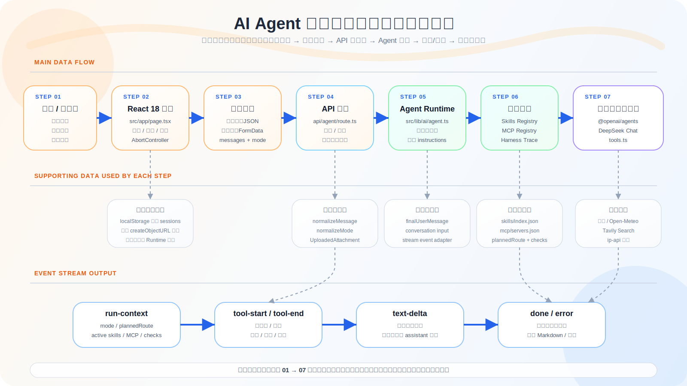

# AI Agent 通用智能助手：项目架构图与面试题

本文档基于当前项目源码整理，覆盖项目定位、技术栈、核心链路、架构图、关键设计点，以及 100 道围绕本项目的面试题和参考答案。

## 项目定位

这是一个基于 Next.js 15、React 18、TypeScript 和 `@openai/agents` 的通用 AI Agent Demo。项目的核心不是单纯聊天，而是把“多轮对话、工具调用、附件上下文、联网检索、周边推荐、Skills Registry、MCP 风格能力注册、Harness/Eval Trace”组合成一个可展示工程深度的 Agent 应用。

项目亮点包括：

- 前端支持多会话、本地持久化、附件上传、图片预览、取消生成、Markdown 渲染、工具调用过程展示。
- 后端 API 同时支持 JSON 请求和 `multipart/form-data` 附件请求。
- Agent Runtime 会根据模式、消息和附件动态激活 skills、MCP 能力和 harness 检查项。
- 工具层封装了定位、天气、联网搜索和周边地点搜索，并把工具调用过程以流式事件回传前端。
- 前端能展示 `Agent Runtime` 卡片，让面试官看到 route、active skills、active MCP servers 和 checks。

## 技术栈

| 类型 | 使用内容 |
|---|---|
| 框架 | Next.js 15 App Router |
| UI | React 18、Tailwind CSS 4 |
| 语言 | TypeScript |
| Agent SDK | `@openai/agents` |
| 大模型接入 | OpenAI SDK 指向 DeepSeek Chat Completions 兼容接口 |
| Markdown 渲染 | `react-markdown`、`remark-gfm` |
| Schema 校验 | `zod` |
| 外部能力 | 高德地图、Open-Meteo、Tavily、ip-api |
| 流式协议 | NDJSON over `ReadableStream` |
| 本地存储 | `localStorage` |

## 核心目录

| 路径 | 职责 |
|---|---|
| `src/app/page.tsx` | 客户端主页面，管理会话、输入、附件、请求状态和流式事件渲染 |
| `src/app/api/agent/route.ts` | Agent API 路由，解析请求、处理附件、创建 NDJSON 流 |
| `src/lib/ai/agent.ts` | Agent Runtime 主流程，构造上下文、创建 Agent、消费模型流 |
| `src/lib/ai/tools.ts` | 工具实现，封装定位、天气、联网搜索和周边搜索 |
| `src/lib/ai/types.ts` | 项目核心类型定义 |
| `src/lib/ai/stream-types.ts` | 前后端流式事件类型 |
| `src/lib/ai/skill-registry.ts` | Skills Registry，负责 skill 命中和 instructions 注入 |
| `src/lib/ai/skills/index.json` | Skills 元数据、触发词和行为规则 |
| `src/lib/ai/mcp-registry.ts` | MCP 风格能力注册和路由摘要 |
| `src/lib/ai/mcp/servers.json` | MCP server 能力目录 |
| `src/lib/ai/mcp/adapters.ts` | MCP adapter，决定能力是否启用以及如何生成 instruction |
| `src/lib/ai/harness.ts` | 运行追踪和检查项生成 |

## 项目架构图

如果 Markdown 预览器没有自动显示图片，可以直接打开 `public/project-architecture-flow.svg` 查看完整流程图。

## 主运行链路

1. 用户在前端输入问题、选择模式，并可上传附件。
2. `page.tsx` 根据是否有附件选择 JSON 或 `FormData` 请求。
3. API 路由解析请求，校验消息、模式和历史消息。
4. 文本附件会读取前 8000 个字符，图片附件只记录元信息和当前模型限制。
5. API 创建 `ReadableStream`，把 Agent 事件编码为一行一个 JSON 的 NDJSON。
6. `agent.ts` 根据请求构建运行上下文。
7. `skill-registry.ts` 根据消息、模式和附件激活 skills。
8. `mcp-registry.ts` 根据模式和附件激活 MCP 风格能力。
9. `harness.ts` 生成 `runId`、规划 route 和检查项。
10. Agent 将基础 instructions、模式 instructions、skills instructions、MCP instructions 和 harness instructions 拼接后运行。
11. 工具开始和结束时分别发出 `tool-start` 与 `tool-end`。
12. 模型文本增量通过 `text-delta` 回传。
13. 最终通过 `done` 回传完整回答和工具调用记录。
14. 前端按事件类型更新 assistant 消息、工具面板和 runtime 卡片。

## 关键设计点

| 设计点 | 项目中的体现 |
|---|---|
| 多轮对话 | 前端保存 `ChatSession`，请求时传入历史 `messages` |
| 流式响应 | 后端输出 NDJSON，前端逐行解析 |
| 可取消请求 | 前端使用 `AbortController`，后端监听 `request.signal` |
| 工具可观测性 | 每个工具 emit start/end，前端展示参数、结果、错误 |
| 附件上下文 | 文本附件提取内容，图片和普通文件说明限制 |
| 模式路由 | `default`、`web`、`nearby` 决定 tools、skills 和 MCP route |
| Skill 沉淀 | skill 通过 JSON 配置，避免所有策略写死在一个 prompt |
| MCP 思维 | 虽然是项目内模拟，但已有 server registry、adapter 和 route label |
| Harness 检查 | 每轮生成 checks，驱动回答遵守工具依据、skill 行为和答案形态 |
| 环境变量隔离 | API Key 从环境变量读取，文档不记录具体密钥 |

## 环境变量

| 变量名 | 用途 |
|---|---|
| `DEEPSEEK_API_KEY` | DeepSeek Chat Completions 兼容接口 |
| `AMAP_WEB_SERVICE_KEY` | 高德地理编码和周边搜索 |
| `TAVILY_API_KEY` | Tavily 联网搜索 |

## 面试题 100 道

### 一、项目总览与技术选型

| 序号 | 面试题 | 参考答案 |
|---:|---|---|
| 1 | 这个项目的核心目标是什么？ | 它是一个通用 AI Agent 助手 Demo，不只是聊天界面，还展示多轮对话、工具调用、联网检索、附件上下文、周边推荐、Skills Registry、MCP 风格能力路由和运行可观测性。 |
| 2 | 为什么选择 Next.js App Router？ | 项目同时需要客户端交互和服务端 API。App Router 可以把 `page.tsx` 作为客户端 UI，把 `/api/agent/route.ts` 作为服务端流式接口，结构清晰；同时 Next.js 15 仍兼容 React 18。 |
| 3 | 为什么主页面需要 `"use client"`？ | 因为页面使用了 `useState`、`useEffect`、`useRef`、浏览器 `localStorage`、文件选择和 `fetch` 流式读取，这些都需要客户端运行。 |
| 4 | 项目中 React 主要负责什么？ | React 负责会话列表、消息渲染、附件状态、请求状态、流式内容增量更新、工具调用展示和 runtime 卡片展示。 |
| 5 | TypeScript 在这个项目中的价值是什么？ | TypeScript 定义了 `ChatMessage`、`AgentRequestBody`、`ToolCallRecord`、`AgentStreamEvent` 等协议，让前后端数据结构保持一致，减少运行时错误。 |
| 6 | 为什么引入 `@openai/agents`？ | 它提供 Agent、tool、run stream 等抽象，让模型调用、工具定义和流式执行更贴近 Agent Runtime 的工程形态。 |
| 7 | 为什么 OpenAI SDK 可以接 DeepSeek？ | `OpenAI` 客户端支持配置 `baseURL`，项目把 baseURL 指到 DeepSeek 的 OpenAI-compatible API，再通过 `setOpenAIAPI("chat_completions")` 使用兼容协议。 |
| 8 | 项目有哪些用户可感知能力？ | 多轮对话、本地会话保存、普通模式、联网模式、周边推荐、附件上传、图片预览、取消生成、Markdown 回答和工具调用过程查看。 |
| 9 | 这个项目相比普通聊天机器人更有工程深度的点在哪里？ | 它把 prompt、tools、skills、MCP capability registry、harness trace 和前端可观测 UI 拆开，体现了可扩展、可观测、可运营的 Agent 系统思路。 |
| 10 | README 中提到的部分文件名和实际文件有差异怎么办？ | README 提到 `skills.ts` 和 `mcp.ts`，当前实际实现是 `skill-registry.ts` 和 `mcp-registry.ts`。面试时可以说明这是命名演进，职责仍对应 Skills Registry 和 MCP Registry。 |

### 二、前端状态与交互

| 序号 | 面试题 | 参考答案 |
|---:|---|---|
| 11 | 前端会话数据结构是什么？ | `ChatSession` 包含 `id`、`title`、`messages`、`createdAt`、`updatedAt`，每条消息是 `ChatMessage`。 |
| 12 | 会话为什么存到 `localStorage`？ | 这是轻量 Demo 的低成本持久化方式，不需要数据库即可保留最近会话，适合前端面试项目展示。 |
| 13 | `hasHydratedRef` 的作用是什么？ | 避免组件首次挂载读取本地会话前就把空数组写回 `localStorage`，从而覆盖已有历史。 |
| 14 | 如何校验本地恢复出来的会话是否合法？ | 通过 `isValidChatSession`、`isValidChatMessage`、`isValidToolCallRecord` 对字段类型、角色、状态进行运行时过滤。 |
| 15 | 为什么需要 `streamingMessageId`？ | 它标记当前正在流式生成的 assistant 消息，前端可以只对这条消息使用纯文本预览，结束后再渲染 Markdown。 |
| 16 | `requestStatus` 有哪些状态？ | 有 `idle`、`loading`、`error`、`cancelled`，分别表示空闲、生成中、失败和已取消。 |
| 17 | 前端如何创建新会话？ | `handleCreateSession` 创建一个空 `ChatSession`，放到会话列表前面，并清空输入、附件和请求状态。 |
| 18 | 清空当前会话和新建会话有什么区别？ | 清空当前会话会保留当前 session id，只清掉消息并重置标题；新建会话会创建新的 session id。 |
| 19 | 为什么会话标题从第一条用户消息生成？ | 这样用户能快速区分会话主题，且不需要额外调用模型生成标题。 |
| 20 | 文件去重是怎么做的？ | 通过 `getFileSignature` 组合文件名、大小和 `lastModified`，再用 `Map` 合并已有文件和新文件。 |
| 21 | 图片预览如何实现？ | 对图片文件调用 `URL.createObjectURL`，保存到 `imagePreviewMap`，组件清理时用 `URL.revokeObjectURL` 释放。 |
| 22 | 为什么文本输入为空时直接报错？ | 避免向后端发送无意义请求。当前前端要求必须有 prompt，虽然后端 FormData 支持 message 或 files 至少一个。 |
| 23 | 为什么请求有附件时不用 JSON？ | 浏览器上传文件需要使用 `FormData`，这样可以同时携带文本字段、历史消息、模式和多个文件。 |
| 24 | 前端如何解析后端流式响应？ | 使用 `response.body.getReader()` 读取字节流，用 `TextDecoder` 解码，按换行切分 NDJSON，每行 `JSON.parse` 后按事件类型处理。 |
| 25 | 为什么最终回答使用 `react-markdown`？ | Agent 回答通常包含列表、表格、代码块等 Markdown 结构，使用 `react-markdown` 和 `remark-gfm` 可以安全、清晰地展示。 |

### 三、API 路由与流式协议

| 序号 | 面试题 | 参考答案 |
|---:|---|---|
| 26 | `/api/agent` 的主要职责是什么？ | 它负责解析请求、标准化输入、处理附件、调用 `runAssistant`，并把 Agent 运行事件以 NDJSON 流返回给前端。 |
| 27 | API 为什么同时支持 JSON 和 FormData？ | 无附件时 JSON 更简单；有附件时必须用 `multipart/form-data` 承载文件。 |
| 28 | `normalizeMessage` 的作用是什么？ | 它过滤并保留结构合法的历史消息，避免不可信请求体直接进入 Agent 上下文。 |
| 29 | `normalizeMode` 的作用是什么？ | 它把 mode 限制在 `default`、`web`、`nearby` 三个合法值，非法值会被忽略。 |
| 30 | 为什么支持 `message` 和 `prompt` 两个字段？ | `extractMessage` 同时兼容两个字段，方便未来接入不同调用方或旧版前端。 |
| 31 | 文本附件为什么只截取前 8000 字符？ | 防止大文件造成服务端性能问题或超出模型上下文，也降低请求成本。 |
| 32 | 哪些附件会提取文本？ | MIME 以 `text/` 开头，或文件名以 `.txt`、`.md`、`.json`、`.csv` 结尾的文件。 |
| 33 | 图片附件当前如何处理？ | 项目记录图片名称、类型和大小，并提示当前文本模型无法直接解析像素内容。 |
| 34 | 普通二进制文件当前如何处理？ | 项目保留文件元信息，但不读取正文，Agent 会被告知当前没有可直接读取的文本内容。 |
| 35 | 为什么使用 NDJSON 而不是 SSE？ | NDJSON 实现简单，每个事件一行 JSON，前端直接按换行解析即可，适合当前 Demo。 |
| 36 | `encodeStreamEvent` 做了什么？ | 它把事件对象序列化为 JSON 字符串，并追加换行，再用 `TextEncoder` 编码成字节。 |
| 37 | 后端如何处理用户取消请求？ | API 监听 `request.signal`，取消时关闭流；如果解析或运行阶段检测到 abort，会返回或传播 499。 |
| 38 | 为什么使用 499 状态码？ | 499 常用于表示客户端关闭请求，虽然不是标准 HTTP 状态码，但在工程实践中语义清楚。 |
| 39 | API 路由如何保证流只关闭一次？ | 在 `ReadableStream` 内部用 `isClosed` 标记，`closeStream` 会先检查状态再关闭。 |
| 40 | 如果 Agent 执行抛错，API 会怎样？ | `runAssistant` 会发送 `error` 事件并抛错，路由捕获后避免非取消错误打断流关闭流程，最外层兜底返回 500。 |

### 四、Agent Runtime

| 序号 | 面试题 | 参考答案 |
|---:|---|---|
| 41 | `runAssistant` 的整体流程是什么？ | 检查 API Key，构建运行上下文，拼接最终用户消息，构建历史输入，发送 `run-context`，创建 Agent，流式运行，转发文本增量和最终结果。 |
| 42 | `assistantInstructions` 主要约束什么？ | 它规定中文助手身份、天气必须调用工具、地点缺失时先定位、失败时不能编造，以及回答要先结论后说明。 |
| 43 | 模式 instructions 如何影响 Agent？ | `web` 模式强调最新信息优先检索，`nearby` 模式强调周边推荐优先搜索地点，默认模式不额外添加模式规则。 |
| 44 | 为什么天气问题不能直接由模型回答？ | 天气是实时信息，模型记忆不可靠，必须使用 `get_weather_by_location` 或先定位再查询。 |
| 45 | `buildAttachmentContext` 做了什么？ | 它把附件元信息和可提取文本拼进用户消息，让模型在当前轮能看到附件上下文。 |
| 46 | `buildFinalUserMessage` 为什么要合并附件和用户问题？ | Agent SDK 的输入需要一个最终用户消息，把附件上下文和问题合并可以让模型统一处理。 |
| 47 | 多轮历史如何传给 Agent？ | `buildConversationInput` 把历史 `ChatMessage` 转换成 Agent SDK 的 `user()` 和 `assistant()` 输入项。 |
| 48 | 如何避免最后一条用户消息重复？ | 如果历史最后一条已经等于本轮最终消息，就直接使用历史，否则追加新的 `user(message)`。 |
| 49 | `extractTextDelta` 为什么要解析 raw event？ | 当前流式事件里模型文本增量藏在 `raw_model_stream_event` 的 choices delta content 中，需要适配提取。 |
| 50 | `buildRunContext` 包含哪些内容？ | 包含 mode、active skills、active MCP servers，以及由 harness 生成的 run trace。 |
| 51 | `buildContextInstructions` 拼了哪些指令？ | 拼接模式规则、skill 指令、MCP 能力说明和 harness 检查要求。 |
| 52 | Agent 创建时传入了什么？ | 传入 name、model、拼接后的 instructions，以及按模式创建的工具列表。 |
| 53 | 为什么 `toolCalls` 要在 `runAssistant` 中维护？ | 这样最终 `done` 事件可以一次性返回完整工具调用记录，前端刷新后仍能展示本轮工具历史。 |
| 54 | `upsertToolCallRecord` 的作用是什么？ | 同一个工具调用先有 running 记录，结束后更新为 success 或 error，避免重复显示两条。 |
| 55 | Agent 出错时为什么还要发送 `error` 事件？ | 前端可以在流没有正常 `done` 的情况下显示错误状态，而不是只看到连接中断。 |

### 五、工具调用与外部服务

| 序号 | 面试题 | 参考答案 |
|---:|---|---|
| 56 | 项目定义了哪些工具？ | `get_user_location`、`get_weather_by_location`、`search_web`、`search_nearby_places`。 |
| 57 | 默认模式有哪些工具？ | 默认模式返回定位工具和天气工具，适合基础问答、位置和天气场景。 |
| 58 | 联网模式有哪些工具？ | 联网模式返回定位工具、天气工具和 `search_web`，不包含周边搜索。 |
| 59 | 周边推荐模式有哪些工具？ | 周边模式返回定位工具、天气工具和 `search_nearby_places`，不包含 Tavily 搜索。 |
| 60 | `get_user_location` 如何获取位置？ | 先通过 `edns.ip-api.com` 获取公网 IP，再用 `ip-api.com` 查询国家、地区、城市、经纬度和时区。 |
| 61 | `get_weather_by_location` 的链路是什么？ | 先用高德地理编码把地点转经纬度，再用 Open-Meteo 查询实时天气。 |
| 62 | 为什么天气查询需要高德和 Open-Meteo 两步？ | 用户输入通常是地名，而 Open-Meteo 需要经纬度，所以需要先地理编码。 |
| 63 | 天气码如何转换成中文？ | `getWeatherDescription` 用 `weatherCodeMap` 把 Open-Meteo 的天气码映射为晴朗、阴天、小雨等中文描述。 |
| 64 | `search_web` 使用什么服务？ | 使用 Tavily Search API，提交 query、topic、search depth 和结果数量，返回 answer 与 results。 |
| 65 | `search_nearby_places` 的搜索逻辑是什么？ | 如果用户传入地点，先高德地理编码；否则用 IP 定位当前位置，再调用高德周边搜索接口。 |
| 66 | 周边搜索为什么设置 `sortrule=distance`？ | 这样返回结果按距离优先，更符合“附近”“最近”这类用户意图。 |
| 67 | 工具参数为什么用 `zod`？ | `zod` 可以定义参数类型、必填规则和描述，方便 Agent SDK 做工具 schema 和参数校验。 |
| 68 | 工具执行前为什么调用 `ensureNotAborted`？ | 如果用户已经取消请求，工具应尽快停止，避免浪费网络请求和继续写入已关闭的流。 |
| 69 | 工具调用如何被前端观察到？ | 每个工具执行开始 emit `tool-start`，成功或失败 emit `tool-end`，前端用 `ToolCallList` 展示。 |
| 70 | 外部服务失败时项目如何处理？ | 工具捕获错误，记录 error 状态并重新抛出，Agent 根据 instructions 说明失败原因，不编造结果。 |

### 六、Skills、MCP 与 Harness

| 序号 | 面试题 | 参考答案 |
|---:|---|---|
| 71 | 什么是 Skills Registry？ | 它把可复用回答策略沉淀成 skill 元数据和规则，而不是把所有规则写死在一个大 prompt 中。 |
| 72 | 当前有哪些 skills？ | `skill.weather-brief`、`skill.web-research`、`skill.local-guide`、`skill.attachment-reader`。 |
| 73 | skill 如何被激活？ | `resolveActiveSkills` 根据用户消息命中 `whenToUse`，再根据 mode 和 attachments 添加默认 skill。 |
| 74 | 为什么 skill 需要 `whenToUse`？ | 它是轻量触发线索，可以让系统根据用户输入自动选择合适的回答策略。 |
| 75 | web 模式默认激活哪个 skill？ | 默认激活 `skill.web-research`，强调基于检索结果回答最新信息。 |
| 76 | nearby 模式默认激活哪个 skill？ | 默认激活 `skill.local-guide`，强调按意图、距离和适用人群排序推荐地点。 |
| 77 | 有附件时默认激活哪个 skill？ | 激活 `skill.attachment-reader`，提醒 Agent 使用附件提取内容并说明模态限制。 |
| 78 | `buildSkillInstructions` 输出什么？ | 输出当前激活 skill 的名称、描述和规则，让本轮 Agent instructions 体现对应策略。 |
| 79 | 项目里的 MCP 是真正外部 MCP 吗？ | 不是，它是项目内模拟的 MCP 风格能力注册表，但已经具备 server registry、adapter、provider 和 route label。 |
| 80 | 当前有哪些 MCP server？ | `mcp.maps`、`mcp.browser`、`mcp.workspace`。 |
| 81 | MCP server 如何判断是否启用？ | 先看 `enabled` 和 mode 是否匹配，再交给对应 adapter 的 `isEnabled` 判断。 |
| 82 | `mapsAdapter` 什么时候启用？ | 在 `default` 和 `nearby` 模式启用，对应地理编码、地点搜索和距离排序能力。 |
| 83 | `browserAdapter` 什么时候启用？ | 在 `web` 模式启用，对应联网检索、网页摘要和检索依据。 |
| 84 | `workspaceAdapter` 什么时候启用？ | 当请求中存在附件时启用，对应附件和本地上下文处理能力。 |
| 85 | Harness Trace 的作用是什么？ | 它为每轮请求生成 runId、plannedRoute、active skills、active MCP servers 和 checks，用于可观测性和回答质量约束。 |

### 七、数据结构与类型设计

| 序号 | 面试题 | 参考答案 |
|---:|---|---|
| 86 | `AgentStreamEvent` 有哪些事件？ | 有 `text-delta`、`tool-start`、`tool-end`、`run-context`、`done` 和 `error`。 |
| 87 | `ToolCallRecord` 记录哪些信息？ | 记录 id、toolName、args、result、error、status、startedAt 和 finishedAt。 |
| 88 | `RunContextEventPayload` 为什么只传部分上下文？ | 前端只需要展示 mode、route、skill ids、MCP server ids 和 checks，不需要暴露完整内部对象。 |
| 89 | `AgentRequestBody` 为什么包含 `messages`？ | 支持多轮对话，把历史上下文传给 Agent，让回答能结合前文。 |
| 90 | `UploadedAttachment` 为什么区分 image、text、file？ | 不同附件能力不同，文本可以提取内容，图片当前只能提示限制，普通文件只能使用元信息。 |

### 八、安全、性能、体验与扩展

| 序号 | 面试题 | 参考答案 |
|---:|---|---|
| 91 | 项目如何避免泄露 API Key？ | API Key 只在服务端从环境变量读取，前端不会直接拿到 `DEEPSEEK_API_KEY`、`AMAP_WEB_SERVICE_KEY` 或 `TAVILY_API_KEY`。 |
| 92 | 当前项目有什么安全风险？ | 文本附件内容会进入模型上下文，需要防范 prompt injection；外部搜索结果也需要来源展示和可信度判断。 |
| 93 | 如何提升附件处理能力？ | 可以增加 PDF、Word 解析器，接入 OCR 或视觉模型，并为大文件做分块、摘要和引用定位。 |
| 94 | 如何把模拟 MCP 升级成真正 MCP？ | 可以新增独立 `mcpServers` 配置，启动真实 filesystem、browser、docs MCP server，并自动同步 tool schema。 |
| 95 | 如何让 skills 更可运营？ | 给 skill 增加版本、owner、状态、命中日志、评估数据和灰度开关，并支持每个 skill 独立文件管理。 |
| 96 | 如何做 Agent 评测？ | 建立 `evals` 数据集和 golden cases，检查是否调用正确工具、是否命中 skill、回答格式是否达标、是否引用检索依据。 |
| 97 | 如何优化流式体验？ | 可以增加首 token 延迟统计、工具耗时展示、自动重试、部分失败提示、滚动锁定和更细粒度的 loading 状态。 |
| 98 | 如何优化性能？ | 可减少历史消息长度、限制附件大小、缓存地理编码结果、缓存搜索结果、按需启用工具，并对大文本做摘要压缩。 |
| 99 | 如果要接入登录和云端会话，应怎么改？ | 可以增加认证层，把 `ChatSession` 持久化到数据库，并按用户隔离 sessions、attachments 和运行日志。 |
| 100 | 面试中如何总结这个项目？ | 可以说这是一个面向 AI Agent 产品的前端工程项目，重点展示了流式交互、工具可观测性、附件上下文、能力路由、skills 沉淀和 harness 追踪，而不仅是一个聊天 UI。 |

## 面试讲解建议

可以按这条主线讲：

1. 先讲用户体验：多会话、附件、模式、流式回答、工具过程可见。
2. 再讲后端协议：JSON/FormData 归一化、附件处理、NDJSON 流。
3. 然后讲 Agent Runtime：instructions 拼装、skills、MCP、harness、tools。
4. 最后讲可扩展性：真实 MCP、更多附件解析、evals、多 Agent 编排、云端会话。

如果面试官追问“这个项目最有价值的工程点是什么”，建议回答：不是某个 UI 组件，而是把 Agent 运行时中的策略、能力、工具、可观测性和用户界面拆成了可演进的模块。
